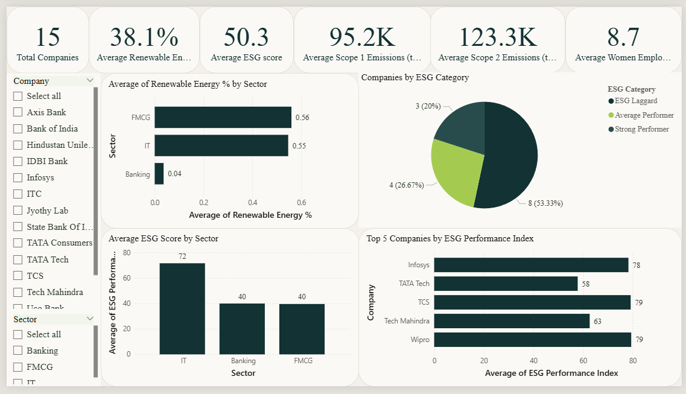
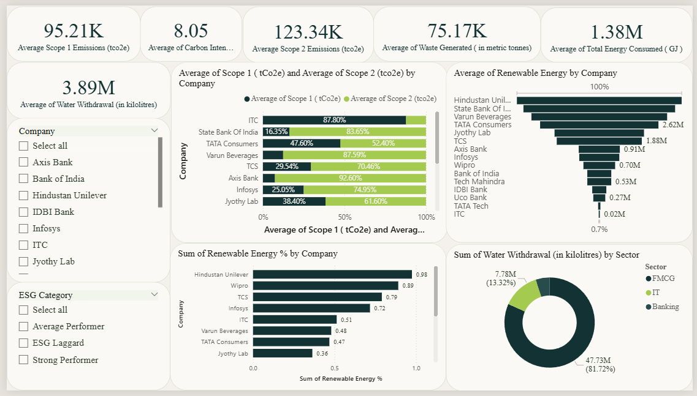

# ESG_Analytics-
An ESG analytics project using Python, MySQL, SQL, and Power BI to analyze BRSR disclosures of Indian companies and build interactive business intelligence dashboards.
This project analyzes Business Responsibility and Sustainability Reporting (BRSR) disclosures of 15 Indian listed companies across the Banking, FMCG, and IT sectors. The project demonstrates an end-to-end analytics workflow from data preprocessing and KPI generation to SQL-based business analysis and interactive Power BI dashboards.

## Executive Dashboard

## Sustainability Dashboard

